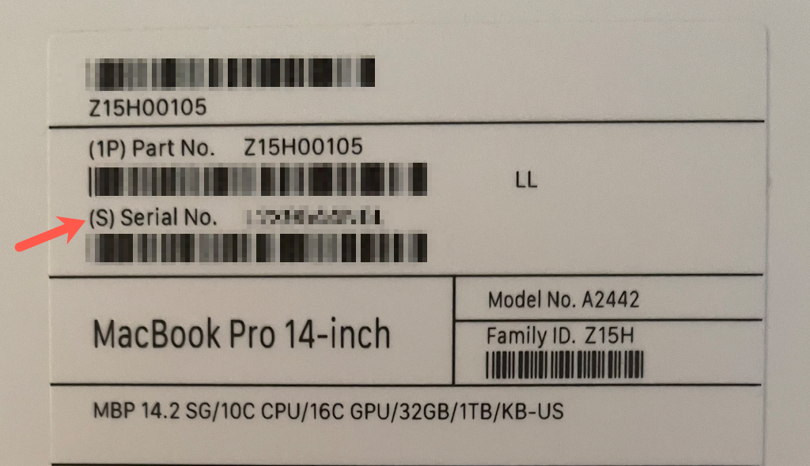
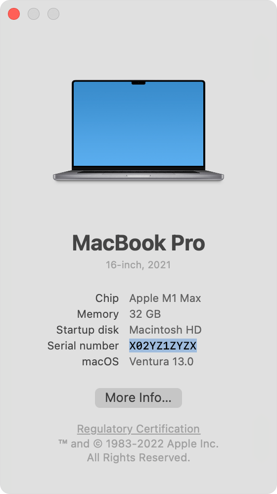
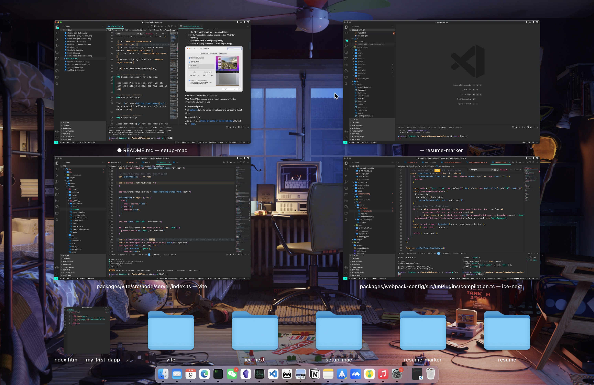
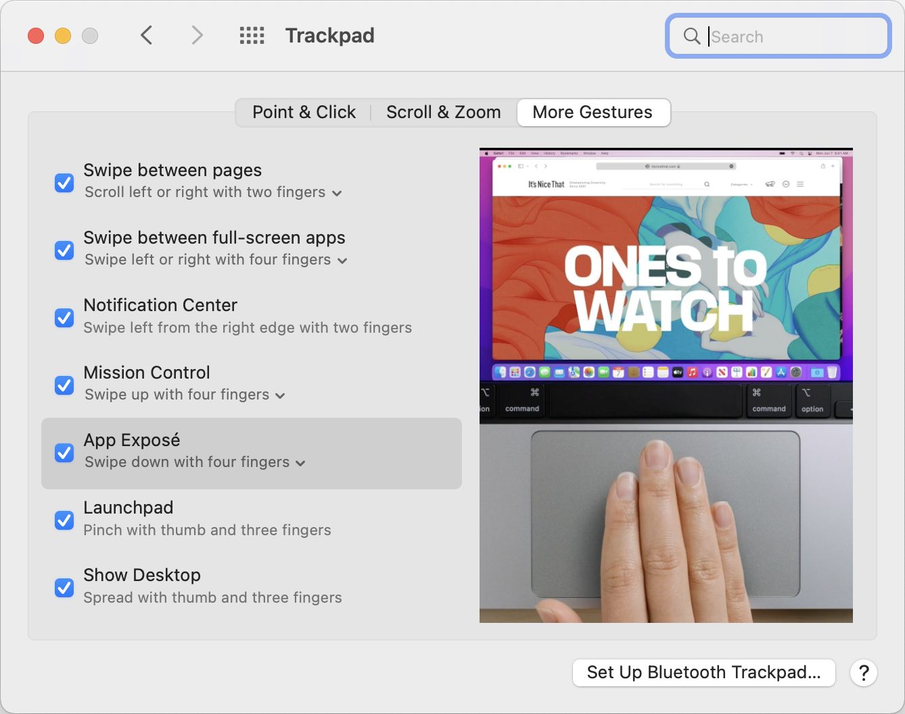
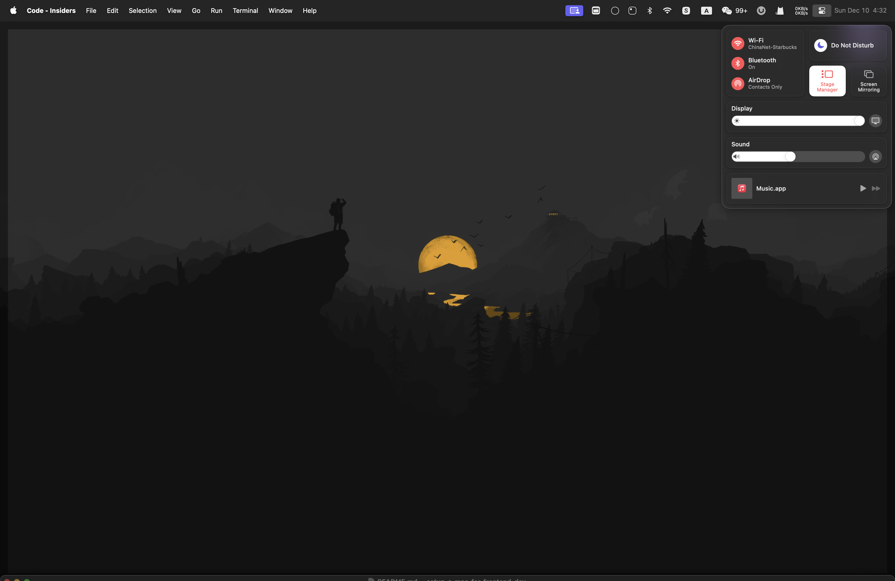
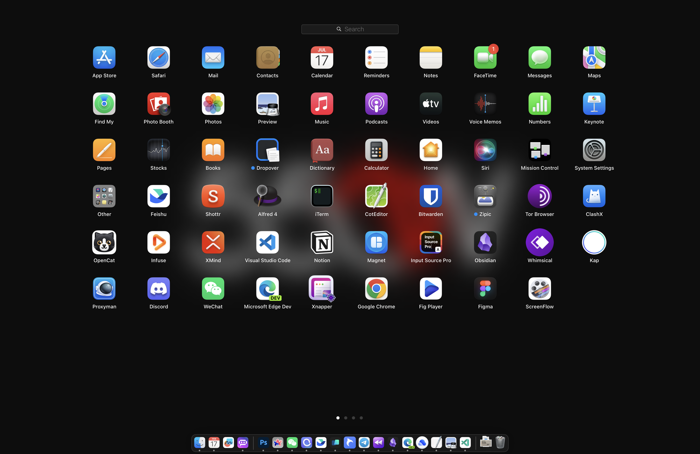
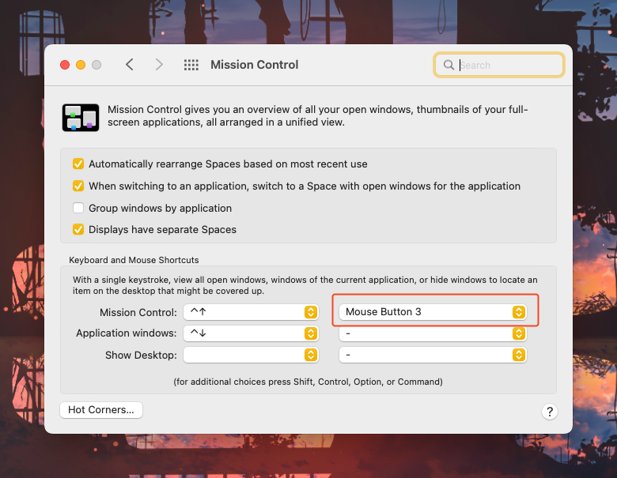

<p align="center">
Yoo, I'm nazha（那吒） 👋 
  <samp>
    <a href="https://twitter.com/xiaokedada">twitter</a> .
    <a href="https://www.nazha.co/">blog</a>

  </samp>
</p>

# Macbook Setup Guide For Web Programmers

Setting up a new Macbook will be tough and cumbersome. Every time I get a new Macbook, I go over the same steps on how to set it up for my working experience.

I create a record of my setup, hoping it's helpful for others too!

+ [Get Started](#get-started)
  + [Check The Machine's Serial Number](#check-the-machines-serial-number)
  + [Online Monitor Testing](#online-monitor-testing)
+ [Immediate First Steps](#immediate-first-steps)
  + [Enable Tap to Click](#enable-tap-to-click)
  + [Enable Three-finger Dragging](#enable-three-finger-dragging)
  + [Enable App Exposé with trackpad](#enable-app-exposé-with-trackpad)
  + [Eanble Stage Manager](#enable-stage-manager)
  + [Accelerating the Dock Animation Speed](#accelerating-the-dock-animation-speed)
  + [Change Launchpad Icon Grid Layout](#change-launchpad-icon-grid-layout)
  + [Change Wallpaper](#change-wallpaper)
  + [Download Edge](#download-edge)
+ [Install Homebrew](#install-homebrew)
+ [Setup Terminal](#setup-terminal)
+ [Install Alfred](#install-alfred)
  + [Use Spotlight Keyboard Shortcut for Alfred](#Use-spotlight-keyboard-shortcut-for-alfred)
  + [Clipboard History](#clipboard-history)
  + [Workflows](#workflows)
+ [Development Tools](#development-tools)
  + [vscode](#vscode)
  + [pnpm](#pnpm)
  + [volta](#volta)
+ [Other Softwares](#other-softwares)
  + [Dropover](#dropover)
  + [iBar](#ibar)
  + [Whimsical](#whimsical)
  + [obsidian](#obsidian)
  + [Notion](#notion)
  + [Other useful software](#other-useful-softwares)

## Get Started

### Check The Machine's Serial Number

For activated products, the serial number can also provide information on the activation date, warranty period, and telephone support availability. In other words, the serial number can help you determine whether the machine is a genuine product manufactured by Apple, whether it is a domestic or international version, and whether it is a refurbished device.

To check the serial number, please visit the official Apple website at [https://checkcoverage.apple.com](https://checkcoverage.apple.com).

Find the serial number printed on the underside of your Mac, near the regulatory markings. It’s also on the original packaging, next to the barcode label.



> If your Mac has already started up, from the Apple menu  in the corner of your screen, choose 「**About This Mac**」. Then find the serial number in the information shown.



### Online Monitor Testing

Check if there are any defective pixels on the monitor. Defective pixels can impact the viewing experience and may worsen over time during use.

Here is a convenient online testing tool to help you complete this task. You can visit [https://www.eizo.be/monitor-test](https://www.eizo.be/monitor-test).

## Immediate First Steps

### Enable Tap to Click

When setting up a new Macbook, one of the first changes we make is enabling the tap-to-click feature for the trackpad.

Go「**System Preference -> Trackpad -> Point & Click**」and enable 「**Tap to click**」 option.


### Enable Three-finger Dragging

In general, "tap to click" on your Macbook to avoid a force-click on the trackpad. But this doesn't work when it comes to dragging and repositioning windows.

Also, I'm a big fan of tree finger dragging.

1. Go 「**System Preference -> Accessibility**」.
2. In the Accessibility sidebar, choose option 「**Pointer Control**」.
3. Click the button 「**Trackpad Options**」.
4. Enable dragging and select 「**three-finger drag**」.


### Enable App Exposé with trackpad

"App Exposé" lets you show you all open and unhidden windows for your current app.



1. Go 「**System Preference -> Trackpad**」.
2. Click the 「**More Gestures**」.
3. Enable "App Exposé" and select 「**Swipe down with four fingers**」.



### Enable Stage Manager

Compared to multiple windows, I prefer [Stage Manager](https://support.apple.com/en-ph/102355). This feature arrived with macOS Ventura, and provides a little bit of ability to make your windows less cluttered.

1. Click Control Center in the menu bar, then click Stage Manager.



### Accelerating the Dock Animation Speed

By default, the Dock on macOS has relatively slow hide/show animations. Here's how to accelerate its speed using Terminal on your Mac.

1. Launch the built-in 「**Terminal**」 app on your Mac.

2. You could accelerate the animation instead of removing it through the following command.

```shell
# Set the duration of the Dock animation to 0.5 seconds.
defaults write com.apple.dock autohide-time-modifier -float 0.5 && killall Dock

# Configure the Dock to have the fastest response time.
defaults write com.apple.dock autohide-delay -int 0 && killall Dock
```

> Recover your settings with the Restore your settings using the following commands.

```shell
defaults delete com.apple.dock autohide-time-modifier && killall Dock

defaults delete com.apple.Dock autohide-delay && killall Dock
```

### Change Launchpad Icon Grid Layout

By default, the Launchpad app grid usually displays icons in 7 rows and 5 columns of apps, but with a little adjustment from the command line of macOS, you can switch and customize the Launchpad icon grid to any number of apps you’d like to see on the Mac.

Here is the current appearance of Launchpad.



Here's how to change the launchpad grid layout:

1. Launch the built-in 「**Terminal**」app on your Mac.

2. Run the following commands eventually customizing the grid size

```shell
# Set grid's rows to 8
defaults write com.apple.dock springboard-rows -int 8

# Set grid's columns to 10
defaults write com.apple.dock springboard-columns -int 10

# Restart the Dock app to apply the changes
killall Dock
```

> To restore the default configuration, enter the following command.

```shell
defaults write com.apple.dock springboard-rows Default
defaults write com.apple.dock springboard-columns Default

killall Dock
```

### Change Wallpaper

Visit [Wallhaven](https://wallhaven.cc/) to find a wonderful wallpaper and replace the default ones.

### Download Edge

After discovering [Chrome are eating my old Mac's battery](https://twitter.com/xiaokedada/status/1495037432273596419), I turned to using [Edge](https://www.microsoft.com/edge).


## Install Homebrew

[Homebrew](https://brew.sh/) is "The Missing Package Manager for macOS".

Simply follow their installation guide, copy `/bin/bash -c "$(curl -fsSL https://raw.githubusercontent.com/Homebrew/install/HEAD/install.sh)"` to the terminal.

> For [GFW](https://en.wikipedia.org/wiki/Great_Firewall) reasons, the Chinese users will fail to connect to github.

> Just copy `/bin/zsh -c "$(curl -fsSL https://gitee.com/cunkai/HomebrewCN/raw/master/Homebrew.sh)"` to your terminal. It will do the same thing when installing homebrew.

## Setup Terminal

**Now, I use [Wrap](https://www.warp.dev/) as a macOS terminal replacement. It's simple and easier to set up.**

---

For those who may like [iTerm2](https://iterm2.com/) more, read the following guide.

1. **Use the Homebrew to install iTerm2**

```shell
$ brew install --cask iterm2
```

2. **Change a few settings of iterm2**

+ Go 「**iterm2 Preferences -> Profiles -> Default -> Window**」, add transparency and blur.


+ Go 「**iterm2 Preferences -> Profiles -> Default -> Keys -> Key Mappings**」, and replace the standard ones with the preset "Natural Text Editing".


3. **Install Oh My Zsh**

The great thing about this is that you can customize your shell and add plugins. Unlike the old Bash shell, which does not look attractive and can make it difficult for you to use.

```shell
$ sh -c "$(curl -fsSL https://raw.github.com/ohmyzsh/ohmyzsh/master/tools/install.sh)"
```

4. **Choose your favorite theme**

There are [multiple themes](https://github.com/ohmyzsh/ohmyzsh/wiki/Themes) you can choose from. My favorite theme is [Honukai](https://github.com/oskarkrawczyk/honukai-iterm-zsh) and it should look like this in the screenshot:


For a complete guide, dive into its [docs](https://github.com/oskarkrawczyk/honukai-iterm-zsh).

5. **Add useful oh-my-zsh plugins**

Oh-my-zsh is powered by plugins. I'll share my top 3 plugins.

```text
plugins=(
 git
 autojump
 zsh-syntax-highlighting
)
```

1. the `git` plugin

The [git](https://github.com/ohmyzsh/ohmyzsh/tree/master/plugins/git) plugin is enabled by default. It provides many aliases and a few useful functions.


To use it, add `git` to the plugins array in your zshrc file:

```text
plugins=(git)
```

2. the `autojump` plugin

Use Homebrew to install [autojump](https://github.com/wting/autojump#installation).

```shell
$ brew install autojump
```

After that, add `autojump` to your zshrc file:

```text
plugins=(... autojump)
```

3. the `zsh-syntax-highlighting` plugin

The installation of [zsh-syntax-highlighting](https://github.com/zsh-users/zsh-syntax-highlighting/blob/master/INSTALL.md) may be tedious. But it is worth the effort.

Clone the [zsh-syntax-highlighting](https://github.com/zsh-users/zsh-syntax-highlighting/blob/master/INSTALL.md) repository in oh-my-zsh's plugins directory:

```shell
$ git clone https://github.com/zsh-users/zsh-syntax-highlighting.git ${ZSH_CUSTOM:-~/.oh-my-zsh/custom}/plugins/zsh-syntax-highlighting
```

Then, activate the plugin in `~/.zshrc`:

```text
plugins=(... zsh-syntax-highlighting)
```

> After adding the plugins to your `.zshrc` file, you have to restart zsh to activate them, using the command `source ~/.zshrc`.

> You can find all my settings of `.zshrc` [here](https://gist.githubusercontent.com/maoxiaoke/0f61f217c428dcfba48067622db83a8e/raw/78da5225ff3cdc8df38db28b8f872a6f6836cfc2/__Configurations__---zshrc.text).

## Install Alfred

> [Raycast](https://www.raycast.com/) is also a popular option right now. 

Now, it is time for [Alfred](https://www.alfredapp.com/) - an alternative to Spotlight.

### Use Spotlight Keyboard Shortcut for Alfred

when installing Alfred, the first thing I do is disable the default shortcut for Spotlight and use it for Alfred.

To do that, open **System Preference -> Keyboard -> Shortcuts**. Click on "Spotlight" and disable "Show Spotlight search".


Open the Alfred settings and use the freed-up `⌘ Space` combination to launch Alfred.


### Clipboard History

Copy and pasting is something developers do every day. Alfred ships with a clipboard manager which supports copied text, images and files.

The only thing I do is remap the shortcut `⌘ .` to the Clipboard History.


### Workflows

I do not have many workflows installed. One of my installed workflows is [YoudaoTranslator](https://github.com/wensonsmith/YoudaoTranslator), which provides a translation service.


Follow the [official guide](https://github.com/wensonsmith/YoudaoTranslator/wiki) to enable "YoudaoTranslator".

## Setting Up Your Mouse

I use [Filco Majestouch 2](https://www.amazon.com/Filco-Majestouch-2-Keyboard-FKBN104M-EB2/dp/B004VKUSG6) for typing. As a result, most of the positions in which I use my MacBook make using the touchpad very difficult.

### Activate Misson Control with a mouse button



## Development Tools

### vscode

I prefer [Vscode](https://code.visualstudio.com/) to code. You can use Github account to sync your settings.

My favorite font is [Overpass Mono](https://fonts.google.com/specimen/Overpass+Mono) and It should look like this in the screenshot:


#### Launch vscode from the command line

Opening vscode from your terminal is a quick, easy way to open up new projects and begin coding faster.

Add the following text to your `.zshrc` files:

```text
code () { VSCODE_CWD="$PWD" open -n -b "com.microsoft.VSCode" --args $* ;}
```

After restarting the terminal or using `source ~/.zshrc`, you can open Vscode by typing `code .`.

Here's how this should look:


### pnpm

[Pnpm](https://pnpm.io/) is fast, disk space-efficient package manager, that works as an alternative to [npm](https://www.npmjs.com/).

Install pnpm using Homebrew:

```shell
$ brew install pnpm
```

### volta

I use [Volta](https://volta.sh/) to manage multiple [Node.js](https://nodejs.org/en/) versions.

## Other Softwares

## Dropover

It's hard to drag & drop on Mac, especially with [Stage Manager](#enable-stage-manager) enabled. Finally, this [app](https://dropoverapp.com/) greatly alleviates this problem.

## iBar

[iBar](https://apps.apple.com/us/app/ibar-menubar-icon-control-tool/id6443843900?mt=12) is a powerful menu bar management tool.

### Whimsical

My favorite drawing app out there. [Whimsical](https://whimsical.com/) is so great that I completed most of my drawings (You can find them [here](https://twitter.com/xiaokedada/status/1522792342893510656) and [here](https://twitter.com/xiaokedada/status/1471691763102679041)).

Because Whimsical supports [PWA](https://developer.mozilla.org/en-US/docs/Web/Progressive_web_apps) already. You can install it as a normal app.

### obsidian

[obsidian](https://obsidian.md/) is the note-taking app I use.

### Notion

[Notion](https://www.notion.so/desktop) is where I write articles.

### Other Useful software

+ [Shottr](https://shottr.cc/) - Screenshot tool, it is powerful and easy to use.
+ [Anki Notes](https://apps.apple.com/us/app/anki-notes-flashcards-maker/id1388842081) - Memory app to learn English.
+ [ScreenFlow](http://www.telestream.net/screenflow/overview.htm) - Video editing & screen recording.
+ [kap](https://getkap.co/) - Screen recorder to generate gif.
+ [magnet](https://apps.apple.com/us/app/magnet/id441258766?mt=12) - Window manager.
+ [Input Source Pro](https://inputsource.pro/) - A tool for multi-language users.
