# Macbook Setup Guide For Web Programmer

Setting up a new Macbook will be tough and cumbersome. Every time I am getting a new Macbook, I go over the same steps on how to set it up for my working experience.

I create a record of my setup, hoping it's helpful for others too!

## Immediate Frist Steps

### Enable Tap to Click

When setting up a new Macbook, one of the first changes we make is enabling the tap-to-click feature for the trackpad.

Go「**System Preference -> Trackpad -> Point & Click**」and enable 「**Tap to click**」 option.

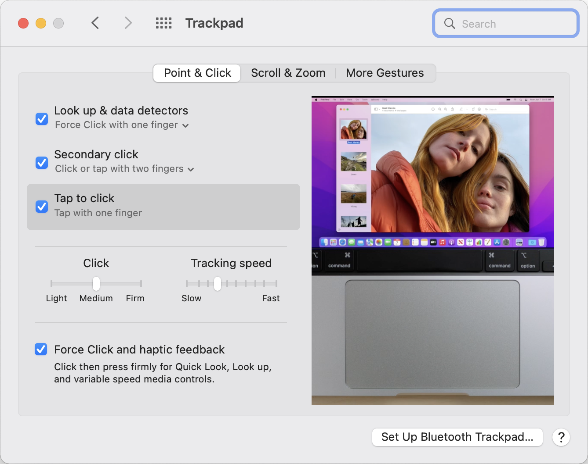

### Enable Three Finger Dragging

In general, "tap to click" on your Macbook to avoid a force-click on the trackpad. But this doesn't work when it comes to dragging and repositioning windows.

Also, I'm big fan of tree finger dragging.

1. Go 「**System Preference -> Accessibility**」.
2. In the Accessibility sidebar, choose option 「**Pointer Control**」.
3. Click the button 「**Trackpad Options**」.
4. Enable dragging and select 「**three finger drag**」.

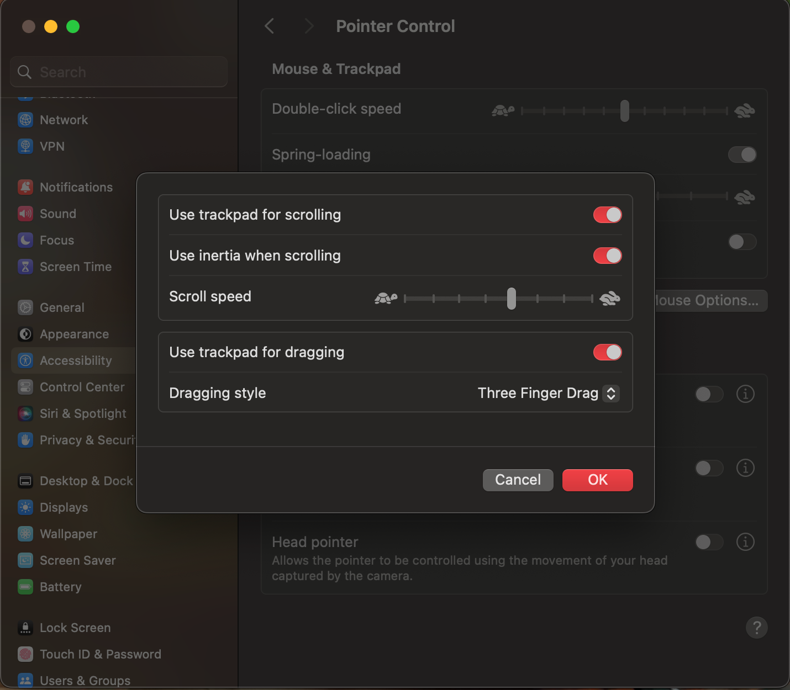

### Change Wallpaper

Visit [wallhaven](https://wallhaven.cc/) to find a wonderful wallpaper and replace the default ones.

### Download Edge

After discovering [chrome are eating my old Mac's battery](https://twitter.com/xiaokedada/status/1495037432273596419), I turned to use [edge](https://www.microsoft.com/zh-cn/edge).

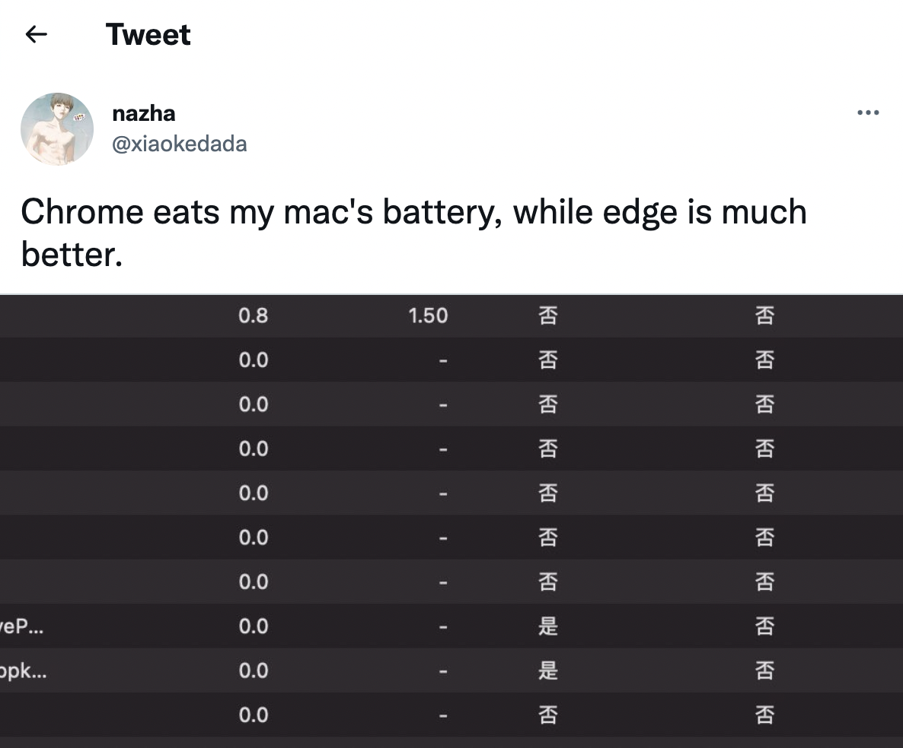

## Install Homebrew

[Homebrew](https://brew.sh/) is "The Missing Package Manager for macOS".

Simply follow their installation guide, copy `/bin/bash -c "$(curl -fsSL https://raw.githubusercontent.com/Homebrew/install/HEAD/install.sh)"` to terminal.

> For [GFW](https://en.wikipedia.org/wiki/Great_Firewall) reasons, the Chinese users will fail to connect to github.

> Just copy `/bin/zsh -c "$(curl -fsSL https://gitee.com/cunkai/HomebrewCN/raw/master/Homebrew.sh)"` to your terminal. It will do the same thing when installing homebrew.

## Setup Terminal

Use [iTerm2](https://iterm2.com/) as macOS terminal replacement.

1. **Use the Homebrew to install iTerm2**

```shell
$ brew install --cask iterm2
```

2. **Change a few settings of iterm2**

+ Go 「**iterm2 Preferences -> Profiles -> Default -> Window**」, add transparency and blur.


+ Go 「**iterm2 Preferences -> Profiles -> Default -> Keys -> Key Mappings**」, replace the standard ones with the preset "Natural Text Editing".

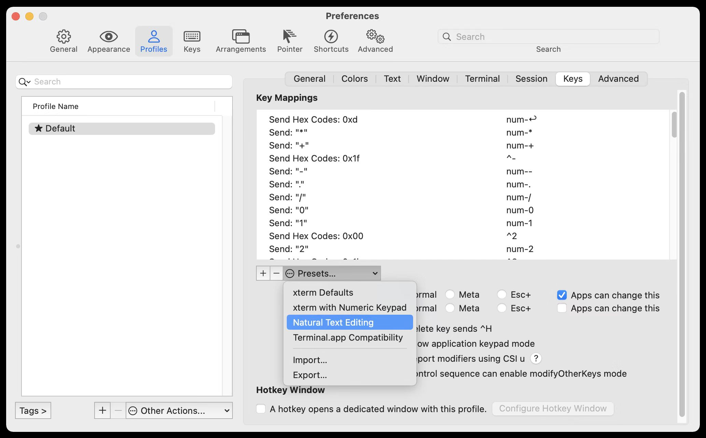

3. **Install Oh My Zsh**

The great thing about this is that you can customize your shell and add plugins. Unlike the old Bash shell, which does not look attractive and can make it difficult for you to use.

```shell
$ sh -c "$(curl -fsSL https://raw.github.com/ohmyzsh/ohmyzsh/master/tools/install.sh)"
```

4. **Choose your favorite theme**

There are [multiple themes](https://github.com/ohmyzsh/ohmyzsh/wiki/Themes) you can choose from. My favorite theme is [honukai](https://github.com/oskarkrawczyk/honukai-iterm-zsh) and it should look like in the screenshot:

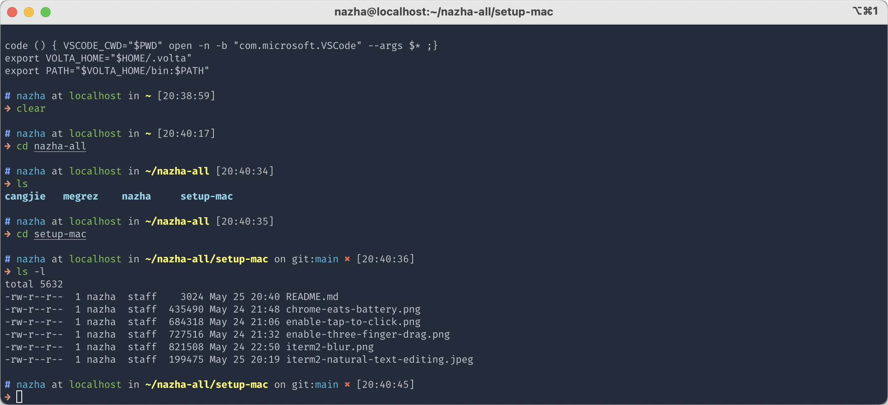

For compelete guide, dive into it's [docs](https://github.com/oskarkrawczyk/honukai-iterm-zsh).

5. **Add useful oh-my-zsh plugins**

Oh-my-zsh is powered by plugins. I'll share my top 3 plugins.

```text
plugins=(
 git
 autojump
 zsh-syntax-highlighting
)
```

1. the `git` plugin

The [git](https://github.com/ohmyzsh/ohmyzsh/tree/master/plugins/git) plugin is enabled by default. It provides many aliases and a few useful functions.

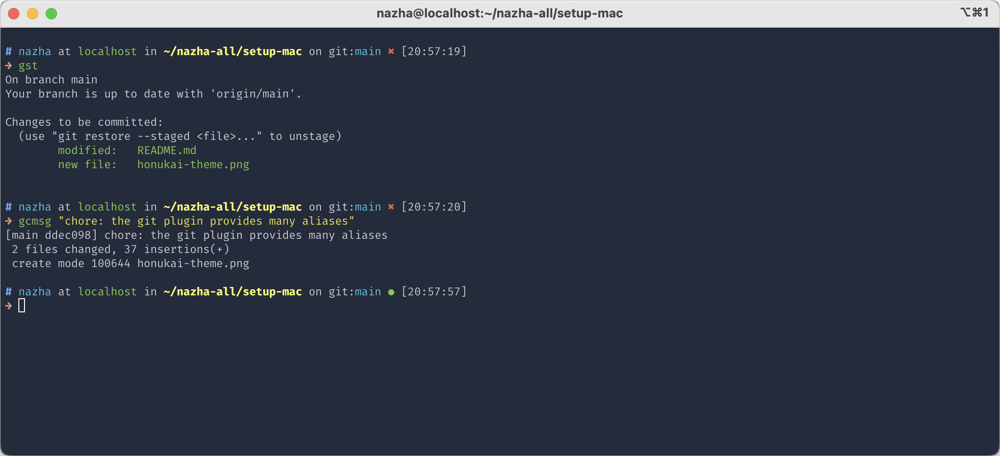

To use it, add `git` to the plugins array in your zshrc file:

```text
plugins=(git)
```

2. the `autojump` plugin

Use Homebrew to install [autojump](https://github.com/wting/autojump#installation).

```shell
$ brew install autojump
```

After that, add `autojump` to your zshrc file:

```text
plugins=(... autojump)
```

3. the `zsh-syntax-highlighting` plugin

The installation of [zsh-syntax-highlighting](https://github.com/zsh-users/zsh-syntax-highlighting/blob/master/INSTALL.md) may be tedious. But it worth the effort.

Clone the [zsh-syntax-highlighting](https://github.com/zsh-users/zsh-syntax-highlighting/blob/master/INSTALL.md) repository in oh-my-zsh's plugins directory:

```shell
$ git clone https://github.com/zsh-users/zsh-syntax-highlighting.git ${ZSH_CUSTOM:-~/.oh-my-zsh/custom}/plugins/zsh-syntax-highlighting
```

Then, activate the plugin in `~/.zshrc`:

```text
plugins=(... zsh-syntax-highlighting)
```

> After adding the plugins to your `.zshrc` file, you have to restart zsh to activate them, using the command `source ~/.zshrc`.

> You can find all my settings of `.zshrc` [here](https://gist.githubusercontent.com/maoxiaoke/0f61f217c428dcfba48067622db83a8e/raw/78da5225ff3cdc8df38db28b8f872a6f6836cfc2/__Configurations__---zshrc.text).

## Install Alfred

Now, it is time for [Alfred](https://www.alfredapp.com/) - an alternative for Spotlight.

## Use Spotlight Keyboard Shortcut for Alfred

when installing Alfred, the first thing I do is disabling the default shortcut for Spotlight and use it for Alfred.

To do that, open **System Preference -> Keyboard -> Shortcuts**. Click on "Spotlight" and disable "Show Spotlight search".

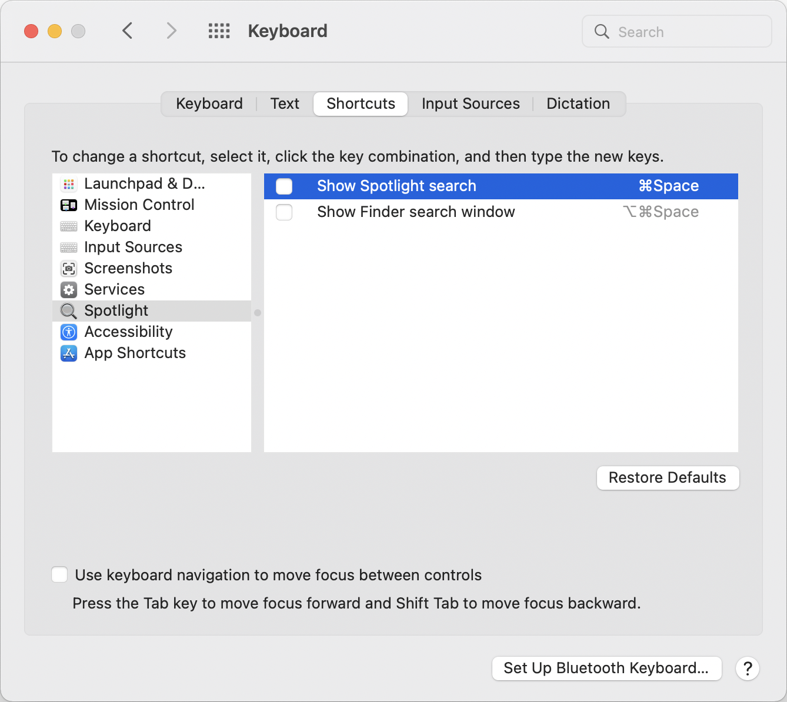

Open the Alfred settings and use the freed up `⌘ Space` combination to launch Alfred.

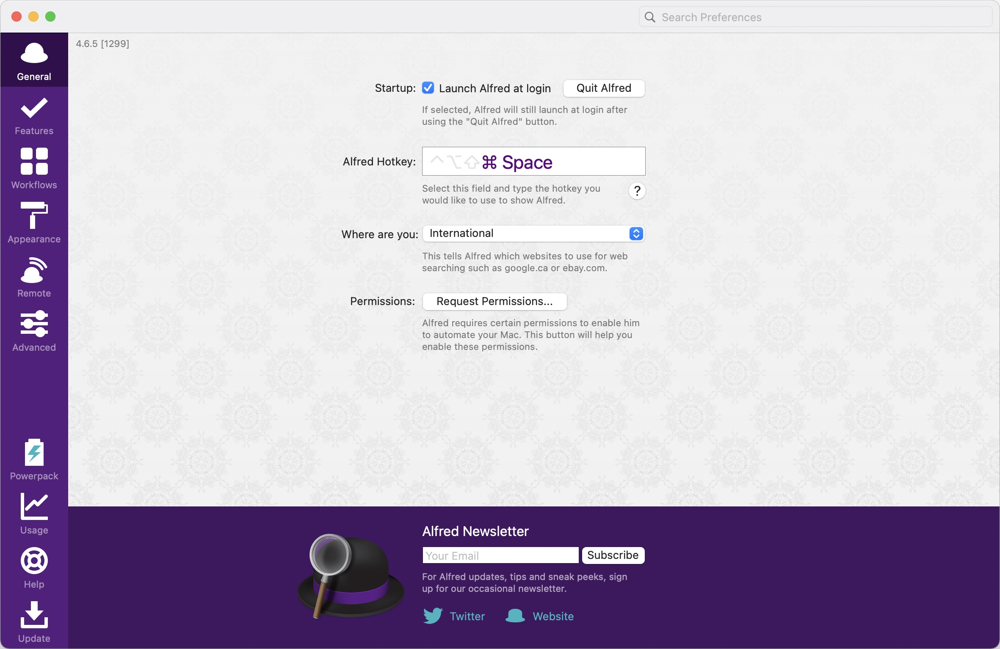

### Clipboard History

Copy and pasting is something developers do everyday. Alfred ships with a clipboard manager which supports copied text, images and files.

The only thing I do is remapping the shortcut to `⌘ .` to the Clipboard History.

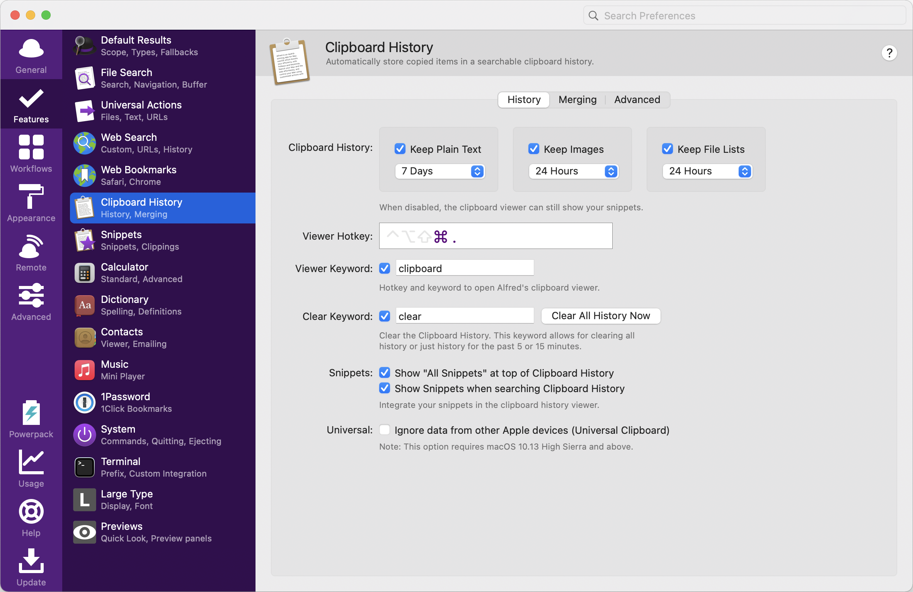

### Workflows

I do not have many workflows installed. One of my installed workflows is [YoudaoTranslator](https://github.com/wensonsmith/YoudaoTranslator), which provides translation service.


Follow the [official guide](https://github.com/wensonsmith/YoudaoTranslator/wiki) to enable "YoudaoTranslator".

## Development Tools

### VSCODE

I prefer [vscode](https://code.visualstudio.com/) to code. You can use github account to sync your setttings.

My favorite font is [Overpass Mono](https://fonts.google.com/specimen/Overpass+Mono) and It should look like in the screenshot:

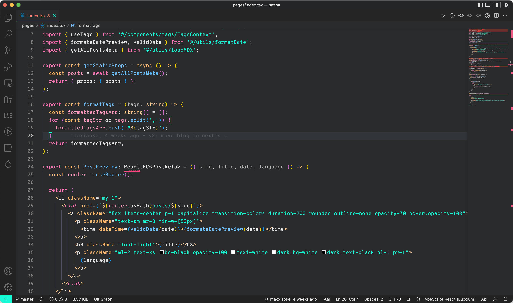

### Launch vscode from the command line

Opening vscode from your terminal is a quick, easy way to open up new projects and begin coding faster.

Add the following text to your `.zshrc` files:

```text
code () { VSCODE_CWD="$PWD" open -n -b "com.microsoft.VSCode" --args $* ;}
```

After restarting terminal or use `source ~/.zshrc`, you can open vscode by typing `code .`.

Here's how this should look:

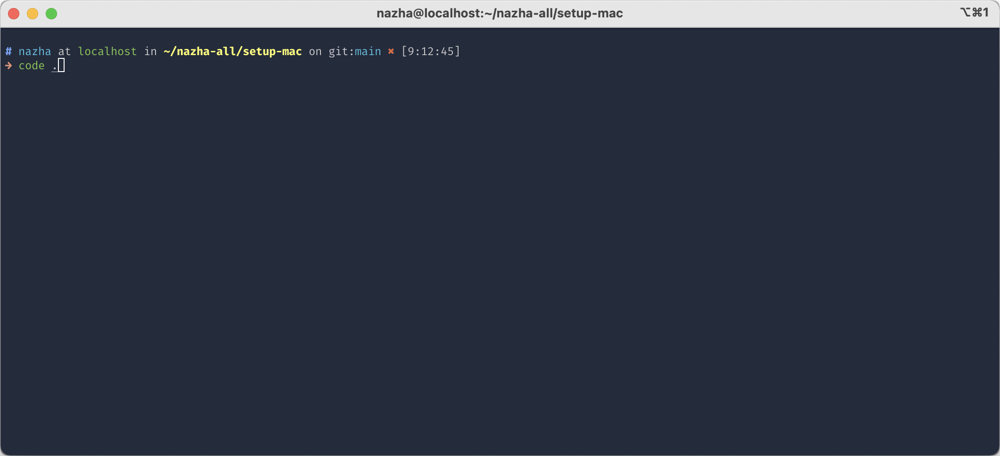

### pnpm

[pnpm](https://pnpm.io/) is fast, disk space efficient package manager, works as an alternative of [npm](https://www.npmjs.com/).

Install pnpm using Homebrew:

```shell
$ brew install pnpm
```

### volta

I use [volta](https://volta.sh/) to manage multiple [Node.js](https://nodejs.org/en/) versions.

## Other Softwares

### Whimsical

My favorite drawing app out there. [Whimsical](https://whimsical.com/) is so great that I compeleted most of my drawings (You can find them [here](https://twitter.com/xiaokedada/status/1522792342893510656) and [here](https://twitter.com/xiaokedada/status/1471691763102679041)).

Because Whimsical support [PWA](https://developer.mozilla.org/en-US/docs/Web/Progressive_web_apps) already. You can install it as normal apps.

### obsidian

[obsidian](https://obsidian.md/) is my note-taking app I use.

### Notion

[Notion](https://www.notion.so/desktop) is where I writing articles.

### Other useful softwares

+ [Shottr](https://shottr.cc/) - Screenshot tool, it is powerful and easy to use.
+ [Anki Notes](https://apps.apple.com/us/app/anki-notes-flashcards-maker/id1388842081) - Memory app to learn English.
+ [ScreenFlow](http://www.telestream.net/screenflow/overview.htm) - Video editing & screen recording.
+ [kap](https://getkap.co/) - Screen recorder to generate gif.
+ [magnet](https://apps.apple.com/us/app/magnet/id441258766?mt=12) - Window manager.
